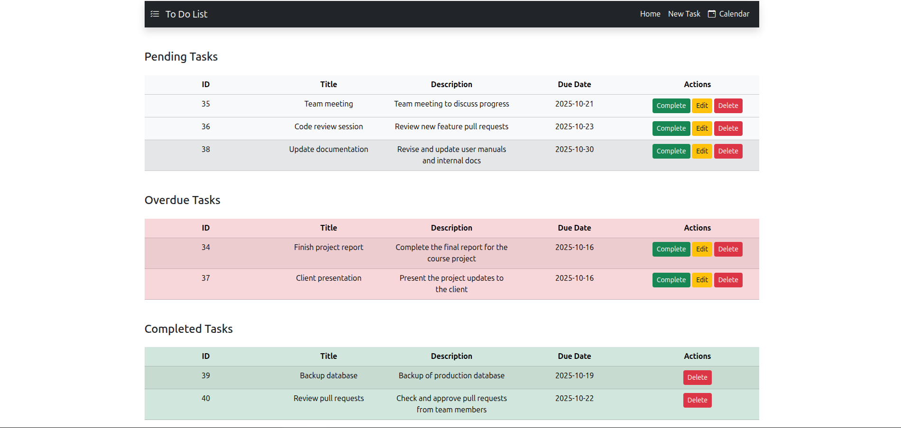
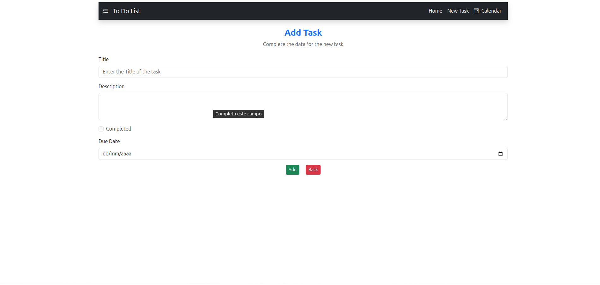
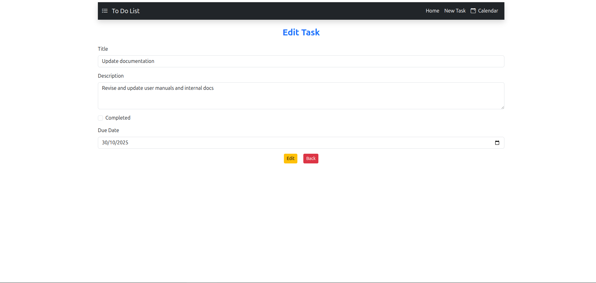

# To-Do List Web Application

A simple and functional **To-Do List web application** built with **Spring Boot**, **JSP**, **JSTL**, and **Bootstrap**.  
It allows users to efficiently manage tasks through a clean, interactive interface.

## 📑 Key Features
- Add, edit, and delete tasks
- View tasks in table or calendar format
- Color-coded status indicators (Pending / Completed)
- Responsive design with Bootstrap
- FullCalendar integration for calendar view
- UTF-8 support (write accents and special characters)
- User session handling (login/logout)

## 🛠️ Technologies Used
- Java 21
- Spring Boot (MVC, Data JPA)
- JSP / JSTL
- Bootstrap 5
- FullCalendar.js
- MySQL / H2 (configurable)
- Maven (dependency management)

## 📂 Project Structure

```
src/
├── main/
│ ├── java/com/example/todolist/
│ │ ├── controller/                 -> Spring MVC Controllers
│ │ ├── model/                      -> JPA Entities
│ │ ├── repository/                 -> Spring Data Repositories
│ │ └── service/                    -> Business Logic Services
│ ├── resources/
│ │ ├── static/                     -> nothing
│ │ └── application.properties      -> Configuration
  └── webapp/
    ├── WEB-INF/
    └── views/
       └── jsp/                     -> JSP files
          └── communitary/          -> Common includes (header, navbar, footer)

```

## 🚀 How to Run
1. Clone the repository:
   ```bash
   git clone https://github.com/JaimeBonBol/To-Do-List.git
   
2. Open the project in your preferred IDE.

3. Configure the database credentials in application.properties.

4. Run the application class: `ToDoListApplication`

5. Open your browser and go to http://localhost:8080/.


## ✨ Application Views


 **Index: Displays tasks in different tables.**


 **Add Task: Form to create a new task.**


 **Edit Task: Form to modify existing tasks.**


 **Calendar: Displays tasks in a calendar with color-coded status. View by month, week, and day.**


## 🙋‍♂️ About this project

This project was one of my first experiences with Spring Boot and JSP.
It allowed me to learn how to integrate Java backend with JSP views and dynamic frontend components like FullCalendar.

### 💬 Feedback & Suggestions

 - Open to suggestions on:

 - Design improvements and best practices

 - Additional features

 - Code organization, documentation, or style

---

> The goal is to practice Java web development by building a complete app with backend, frontend, and database integration.
